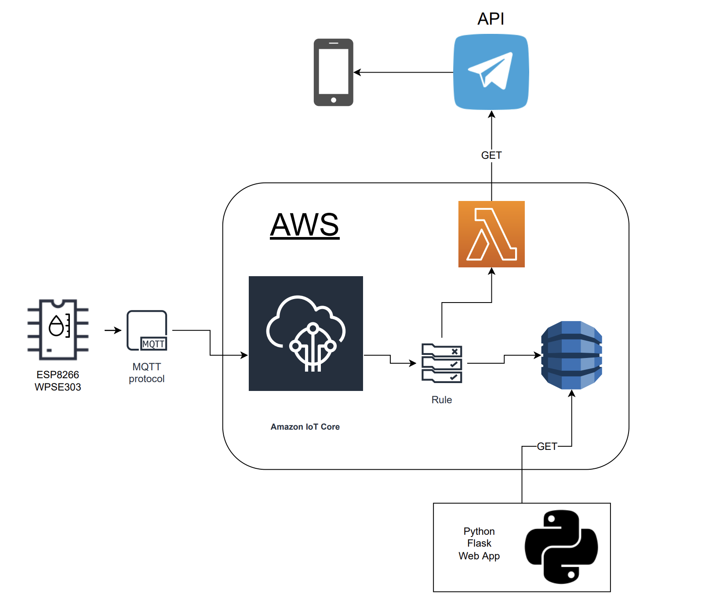
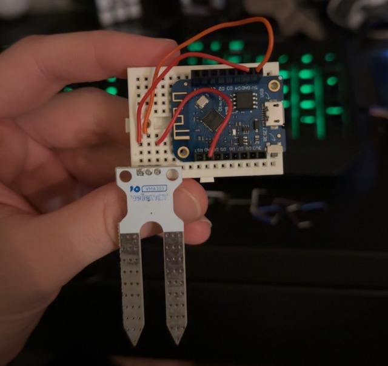
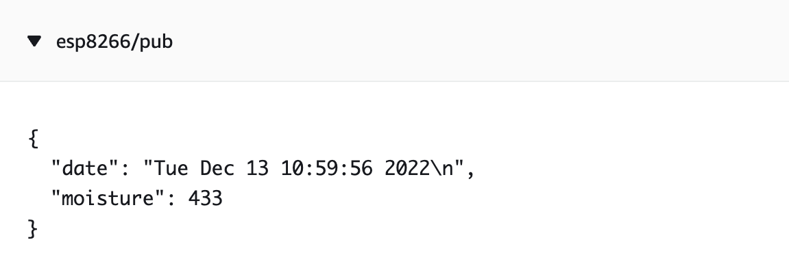
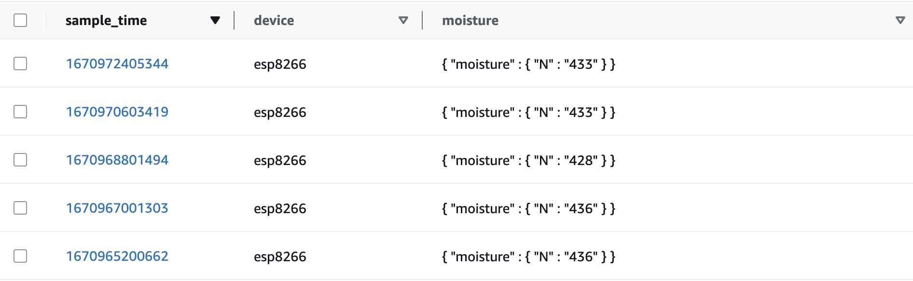
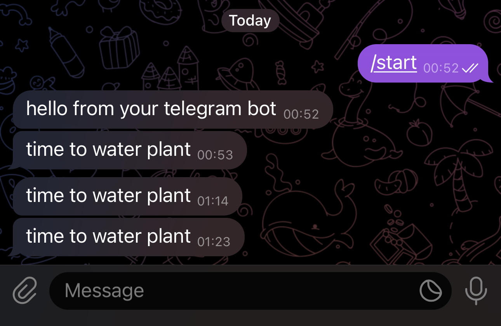
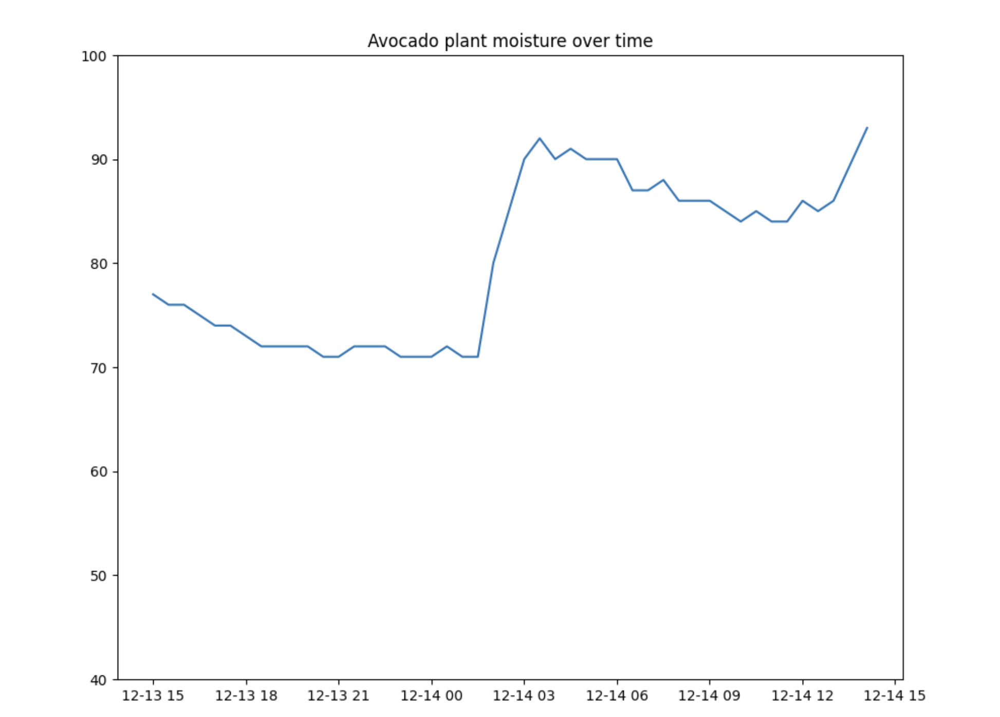

# Waterplant 🪴

## About

This is a Cloud service school project with ambition to enlarge my home automations. In this project I will use an ESP8266 with the help of a soil sensor to send MQTT messages to AWS IoT Core. I will store the data in DynamoDB and if my plant is too dry a Lambda function will trigger and send a message/notification on Telegram. I will visualize my data with Python Flask web application/server to see moisture at the moment and over time 🥑.



## Overview
* ### Setting up ESP8266

My first thought was to use an ESP8266-01 with a 3V, 230mAh battery (CR2032) and enable deep sleep mode which only uses ~20uA (according to ESP8266 datasheet). But I realized pretty soon that i had to solder the tiny tiny GPIO 16 on ESP8266EX chip with ESP8266-01 reset pin to use deep sleep mode. And also A0 to use analog input. (reference below)


So I bought a Wemos D1 Mini v3 instead because of good price, good size and it has A0, RST & the 16 pin so I could use the soil sensor and deep sleep to save battery. I calculated that with the CT2032 battery it would last for 59 days if ESP only sent MQTT messages 3 times a day. But the Wemos D1 Mini returns ```rst cause:5``` when waking up from deep sleep mode and after some research I found it to be either because of bad soldering or bad wiring, and I had both. So instead of batteries I use power from USB (because battery would only last like 3 hours without deep sleep) and have an internal timer that sends mqtt messages every half hour instead of three times a day. (reference below)



* ### Setting up AWS IoT

When the device was up and running I created a new device in AWS IoT Core and added certificate to authenticate connection between ESP8266 and AWS IoT. At the same time I added a new policy with MQTT topics so ESP could send messages to broker (AWS IoT). Didn't of course get it to work at first so I changed a lot in my arduino code to then realized that I only had to send a test message to the right topic with AWS IoT MQTT Test client. After that everything worked as intended and I started to receive data from my ESP8266.



* ### Setting up AWS DynamoDB

When storing my data I chose DynamoDB, which is a NoSQL database, so I could have everything inside AWS. The table was pretty easy and straight forward to set up and I also found out that I could use ```${timestamp()}``` as value in Partition key so I didn't even need to send timestamp from ESP8266 anymore.



* ### Setting up AWS Lambda Function 

Now my device sends data every 30 minute to AWS IoT and stores it in the AWS Dynamo database but I want to know when I need to water my plant. So I created a Telegram bot with @BotFather and got a token to use with their API. I read that I can use ```import requests``` with python3.7 in Lambda so that was the obvious choice.
```python
import json
import requests

TELEGRAM_MSG = "time to water plant"

def lambda_handler(event, context):
    bot_request = f'https://api.telegram.org/bot{TELEGRAM_TOKEN}/sendMessage?chat_id={TELEGRAM_CHAT_ID}&text={TELEGRAM_MSG}'
    print(event)
    print(bot_request)
    response = requests.get(bot_request) 
    return {
       'statusCode': response.status_code,
       'msg': json.dumps('Message sent with success!'),
       'body': json.dumps(response.json())
   }
```
I then created a new rule in AWS IoT that triggers this Lambda function whenever my plant is to dry/needs watering and tested if everything works with AWS IoT MQTT Test Client. It did!🤠



* ### Setting up Flask to visualize data

Lastly I configured awscli on my computer and put together a simple flask server to visualized my data with matplotlib.

